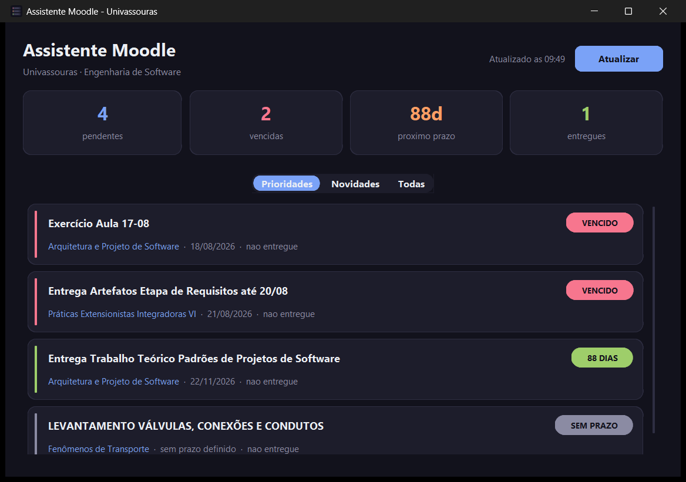
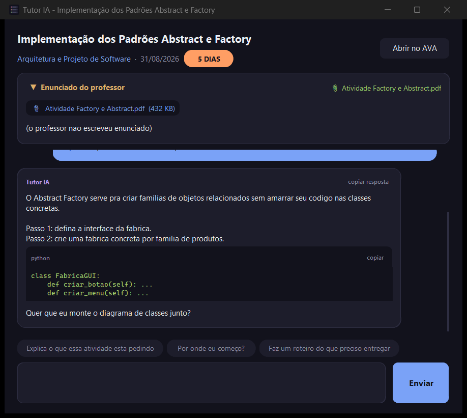

# Assistente Moodle

Um assistente de desktop para o AVA (Moodle) da Universidade de Vassouras. Ele abre junto
com o Windows, mostra o que você precisa entregar e em quanto tempo, avisa quando aparece
material novo, e — clicando numa atividade — abre um chat com uma IA que já leu o enunciado
e os PDFs que o professor anexou.

Nasceu de um problema simples: descobrir que uma entrega venceu **depois** que ela venceu.



## O que ele faz

- **Ordena por urgência, não por matéria.** A aba *Prioridades* lista o que falta entregar
  em ordem de prazo, com etiqueta colorida: vermelho para vencido ou entrega hoje, laranja
  com contagem regressiva para a próxima semana, verde para o que ainda dá folga.
- **Avisa por notificação do Windows** quando um prazo entra em 3 dias, de novo na véspera e
  no dia. E quando um professor posta material novo ou muda uma data. Cada aviso aparece uma
  vez só — o app lembra o que já mostrou.
- **Detecta novidades** comparando com a última checagem, então você vê o que mudou desde
  ontem em vez de ter que reler tudo.
- **Atualiza sozinho** ao abrir e a cada 30 minutos.
- **Tutor de IA por atividade** (opcional): clicar num cartão abre um chat sobre aquela
  atividade específica. Botão direito abre a atividade no AVA.

## O tutor de IA



A janela de chat manda para o Gemini o **enunciado que o professor escreveu** e os **PDFs
anexados**. O PDF vai inteiro, não só o texto extraído: o Gemini lê PDF de forma nativa,
então diagramas e imagens do enunciado também contam. Isso importa mais do que parece —
há atividade que não tem enunciado escrito nenhum, só o anexo.

A IA é instruída a agir como tutor: explicar o raciocínio e mostrar o caminho, em português.
Blocos de código têm botão **copiar** (copia o código cru, sem a marcação markdown), e a
resposta inteira tem **copiar resposta**.

Modelos do Gemini são aposentados de tempos em tempos. Quando o modelo configurado sai do ar,
fica sem cota ou trava, o app testa os outros disponíveis e usa o que responder — sem te
mostrar erro.

## Instalação

Precisa de **Python 3.10 ou mais novo** no Windows.

```bash
git clone https://github.com/AndreyViolante/moodle-assistente.git
cd moodle-assistente
pip install -r requirements.txt
```

Depois copie o arquivo de exemplo e preencha:

```bash
copy .env.exemplo .env
```

**Só o `MOODLE_TOKEN` é obrigatório.** Para pegá-lo: entre no AVA, clique no seu nome →
*Preferências* → *Chaves de segurança*, e copie a chave do serviço *Moodle mobile web service*.
Esse token vale como sua senha — o `.env` está no `.gitignore` justamente por isso.

O resto o próprio Moodle informa: seu usuário sai do token e as disciplinas são aquelas em
que você está matriculado. Preencha as outras variáveis só se precisar:

| Variável | Para quê |
|---|---|
| `MOODLE_TOKEN` | **Obrigatório.** Acesso às suas atividades. |
| `MOODLE_URL` | Se você não for da Universidade de Vassouras. |
| `MOODLE_USER_ID` | Em branco, sai do token. |
| `MOODLE_COURSE_IDS` | Em branco, usa todas as matriculadas. Preencha para ignorar alguma. |
| `GEMINI_API_KEY` | Liga o tutor de IA. Grátis em [aistudio.google.com/apikey](https://aistudio.google.com/apikey). |
| `GEMINI_MODEL` | Fixa um modelo. Em branco, o app escolhe. |

Sem a chave do Gemini todo o resto funciona igual — a janela de chat abre mostrando o
enunciado e os anexos, só não conversa.

## Usando

```bash
pythonw app.py
```

`pythonw` abre só a janela; `python` mostra o console junto, útil para ver erros.

Também dá para usar pelo terminal, sem interface:

```bash
python assistente.py
```

E para testar se o token está valendo:

```bash
python teste_simples.py
```

### Abrir junto com o Windows

```bash
powershell -ExecutionPolicy Bypass -File instalar_atalho.ps1
```

Isso cria um atalho na pasta *Inicializar*. Para desfazer:

```bash
powershell -ExecutionPolicy Bypass -File instalar_atalho.ps1 -Remover
```

## Como está organizado

| Arquivo | Papel |
|---|---|
| `moodle_core.py` | Conversa com a API REST do Moodle: atividades, prazos, novidades, download de anexos. |
| `app.py` | Janela principal: resumo, abas, cartões. |
| `janela_chat.py` | Janela do tutor de IA. |
| `ia.py` | Cliente do Gemini: escolha de modelo, envio de PDF, tratamento de erro. |
| `notificacoes.py` | Notificações do Windows, sem repetir aviso já dado. |
| `ui.py` | Peças compartilhadas: paleta, área de rolagem, etiquetas. |
| `assistente.py` | A mesma coisa, em texto, no terminal. |
| `gerar_icone.py` | Desenha o `icone.ico`. Só precisa rodar se mudar o desenho. |
| `instalar_atalho.ps1` | Liga (ou desliga) a abertura junto com o Windows. |

Arquivos que ficam só na sua máquina: `.env` (segredos), `last_check.json` (quando foi a
última checagem) e `notificados.json` (o que já foi avisado).

## Testes

```bash
python teste_config.py     # configuração e descoberta automática
python teste_ia.py         # enunciado, anexos, escolha de modelo
python teste_chat.py       # janela de chat de ponta a ponta
python teste_rolagem.py    # rolagem
python teste_hover.py      # hover e clique dos cartões
```

Nenhum deles gasta cota da API nem depende da rede: a API do Google é simulada. O mais
demorado leva cerca de 20 segundos (ele espera a interface assentar entre as verificações).

Vale dizer o que esses testes existem para pegar. Boa parte deles nasceu de bug real, e três
armadilhas do CustomTkinter/Tk no Windows se repetiram tanto que estão documentadas no código:

- **`bind()` e `configure()` desviam para os widgets internos.** Ligar um evento no widget
  "de fora" pode nunca disparar. Onde importa, o código usa `tk.Misc.bind`.
- **A roda do mouse vai para o widget com foco, não para o que está sob o cursor.** Ligar a
  roda nos widgets do conteúdo simplesmente não recebe nada; a ligação precisa ser global e
  despachar para a janela certa.
- **`CTkLabel` multiplica o `wraplength` pela escala de DPI.** Passar o valor em pixels faz o
  texto quebrar mais largo que o espaço e sair cortado. Por isso existe `ui.wrap()`.

Um teste que passa não prova muita coisa se ele simular o evento diferente de como o sistema
entrega — foi exatamente assim que uma rolagem quebrada passou em 12 verificações.

## Limitações conhecidas

- Windows apenas: as notificações e o atalho de inicialização usam APIs do sistema.
- A conversa com o tutor se perde ao fechar a janela; não há histórico em disco.
- Só lê atividades do tipo *tarefa* (`mod_assign`). Questionários e fóruns não aparecem.
- A API do Gemini às vezes fica lenta. A janela mostra os segundos enquanto espera e troca
  de modelo se o atual travar.
